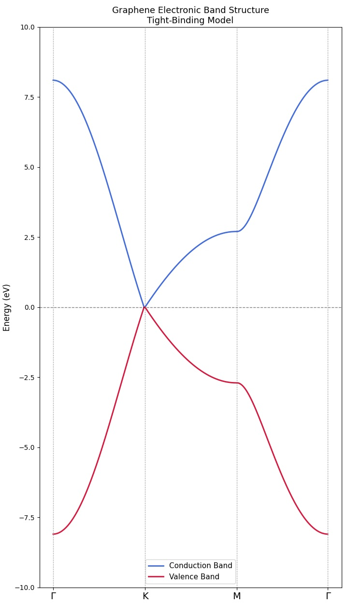

# Graphene Band Structure — Tight-Binding Model

## Overview
Numerical simulation of graphene's electronic band structure
using the tight-binding model with nearest-neighbor hopping.

## Physics
- **Model**: Tight-Binding (nearest neighbor)
- **Lattice**: Honeycomb (2 atoms per unit cell)
- **Hopping parameter**: t = 2.7 eV
- **C-C bond length**: a = 1.42 Å

## Key Results

| Point | E+ (eV) | E- (eV) | Meaning |
|-------|---------|---------|---------|
| Γ     | +8.1    | -8.1    | Maximum bandwidth |
| K     | ≈ 0     | ≈ 0     | Dirac point |
| M     | +2.7    | -2.7    | Van Hove singularity |

## Band Structure

## Key Finding
Graphene is a **zero-gap semimetal**.
The conduction and valence bands meet at
the K and K' points (Dirac points) with E = 0.
This gives rise to massless Dirac fermions
with Fermi velocity vF ≈ 10⁶ m/s.

## How to Run
pip install numpy matplotlib
python src/graphene_bands.py

## References
- Castro Neto et al., Rev. Mod. Phys. 81, 109 (2009)
- Reich et al., Phys. Rev. B 66, 035412 (2002)

## Author
[BENALI ABDELKADER] — Master Physics
[Universty of Algers 1 ] — 2026
